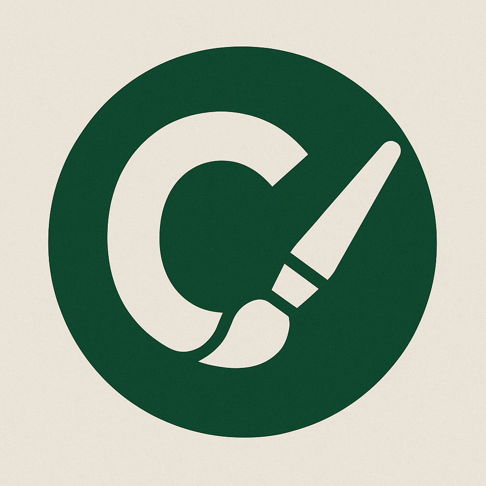
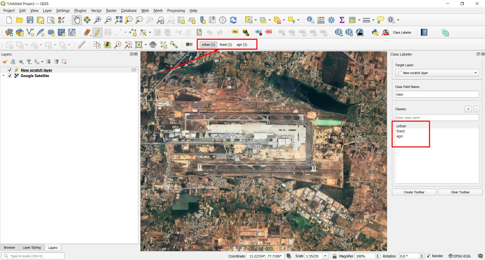

  

# Class Labeler for QGIS

Class Labeler is a QGIS plugin for labeling polygons or images for segmentation or classification using a brush tool and hotkeys.

## Features

- Paint or erase polygons with an integrated brush tool
- Switch classes instantly with number key hotkeys
- Works with standard QGIS editing tools and existing layers

**Note:** The brush tool requires the target layer to be in editing mode. If the layer isn't editable, drawing will warn and abort.

- **Left-click + drag**: Paint polygons
- **Right-click + drag**: Erase areas
- **Shift + scroll**: Adjust brush size
- **Ctrl + Shift + scroll**: Rotate brush
- **Tab**: Cycle through brush shapes
- **Ctrl while drawing**: Merge with existing features

## Demo

[Watch the demo video](assets/media/12-19-36-Clip20250909122124.mp4)

## Installation

1. Copy the `class_labeler` plugin folder to your QGIS profile's plugins directory
2. Enable **Class Labeler** in the QGIS Plugin Manager
3. Open the dock widget or toolbar to start labeling

## Release publishing

This repository includes a GitHub Actions workflow that packages the plugin and
publishes it to the official QGIS plugin repository whenever a GitHub release
is published. Before triggering a release, configure the following secrets in
your GitHub repository settings:

- `QGIS_PLUGIN_REPO_USERNAME`
- `QGIS_PLUGIN_REPO_PASSWORD`

These credentials correspond to your QGIS plugin repository account and are
used by the workflow to authenticate when uploading the packaged plugin.

## Usage

1. Select a target polygon layer and set the class field
2. Add class values and assign them to hotkeys (1–9)
3. Use the brush to paint or erase while switching classes with the hotkeys

## Acknowledgements

This plugin builds on the [Draw-By-Brush](https://github.com/josephburkhart/Draw-By-Brush) tool by Joseph Burkhart.

