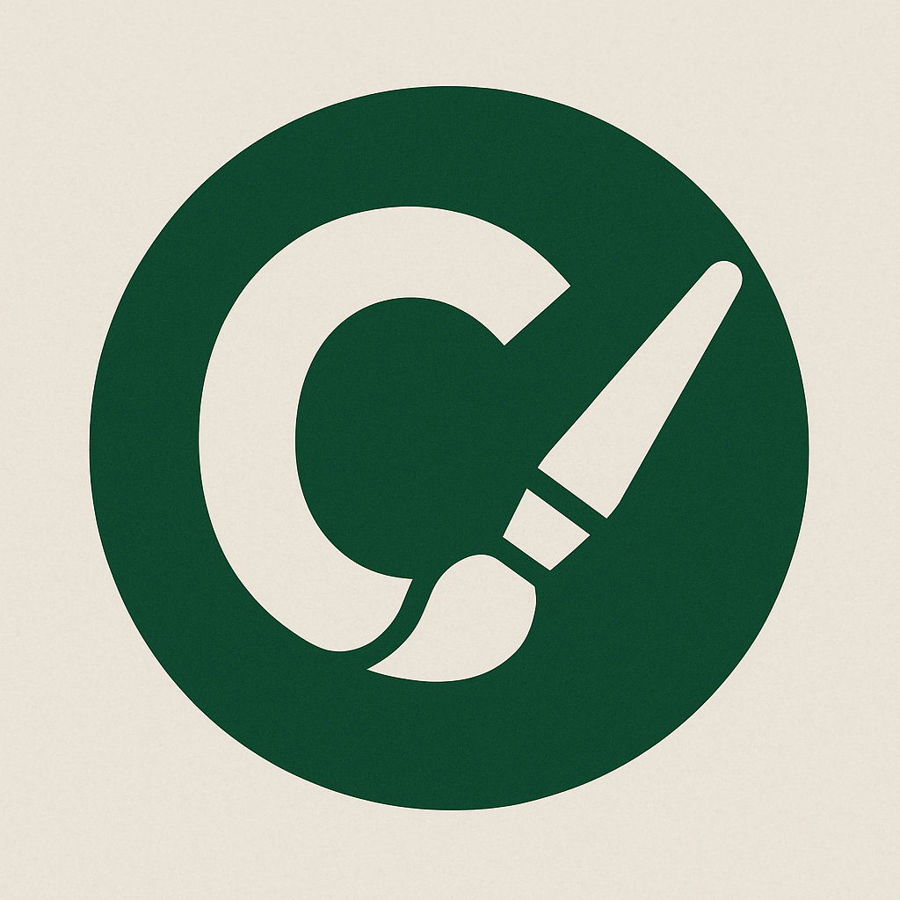

  

# Class Labeler for QGIS

Class Labeler is a QGIS plugin for labeling polygons or images for segmentation or classification using a brush tool and hotkeys.

## Features

- Paint or erase polygons with an integrated brush tool
- Switch classes instantly with number key hotkeys
- Works with standard QGIS editing tools and existing layers

## Demo

[Watch a short demo video](https://samplelib.com/lib/preview/mp4/sample-5s.mp4)

## Installation

1. Copy plugin files to your QGIS profile's plugins directory
2. Enable **Class Labeler** in the QGIS Plugin Manager
3. Open the dock widget or toolbar to start labeling

## Usage

1. Select a target polygon layer and set the class field
2. Add class values and assign them to hotkeys (1–9)
3. Use the brush to paint or erase while switching classes with the hotkeys

## Acknowledgements

This plugin builds on the [Draw-By-Brush](https://github.com/josephburkhart/Draw-By-Brush) tool by Joseph Burkhart.

